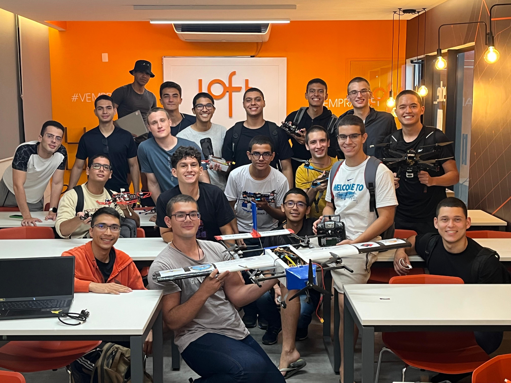

<h2 style="text-align: center;">Reunião Geral com novos membros</h2>

Realizamos uma reunião geral com toda a equipe para mostrar mais detalhadamente o que é a iniciativa eVTOL, o que já conquistamos e o que queremos conquistar.
Esse encontro foi essencial para garantir que todos estejam cientes dos objetivos e desafios dos projetos e competições.

    

 

<h2 style="text-align: center;">Treinamento de Hardware</h2>

Como bixos, por natureza, não sabem de nada, nós os ajudamos dando um pontapé inicial para que não fiquem totalmente perdidos!
O primeiro treinamento foi o de hardware, feito com uma dinâmica que combinava prática e teoria com o objetivo de familizarizar os novos membros com o sistema dos nossos drones.

    
    

        

            Durante o treinamento, foi apresentada a estrutura geral do drone - frame, hélices, motores brushless, ESCs, placas de distribuição, etc.
        

        <ul>
            <li>Qual é a função da Raspberry PI? E da PixHawk?</li>
            <li>O que são sensores inerciais? Para que servem as câmeras?</li>
            <li>O que é odometria e o que é sensor fusion?</li>
        </ul>
        <h4 align="center">Tudo isso foi disutido nessa parte do treinamento!</h4>
         
        

            
        

    

 

<h2 style="text-align: center;">Treinamento de Software</h2>

Durante o treinamento de software, os ~~bixos~~ novos membros tiveram contato com a simulação do drone.
Foram abordados:

    
    

 

<h2 style="text-align: center;">Alunos do ITA visitam SKYRATS</h2>

Nossa equipe realizou uma visita à skyrats, equipe de drones da USP. Essa interação fortaleceu nossa rede de colaboração estreitando laços entre os que virão a manter a indústria de drones do Brasil.

    

        
    

    

        
        
    

 

        <video controls width="800" width="600">
            <source src="./assets/videos/theoffice_visita_skyrats.mp4" type="video/mp4">
        </video>
    

 
<h3 style="text-align: center;">ZIPA DRONEZADA!!</h3>

    
    

 

<h2 style="text-align: center;">Montagem do Drone</h2>

    

        <video controls width="800" width="250">
            <source src="./assets/videos/etapas_da_montagem_do_drone.mp4" type="video/mp4">
        </video>
    

    

        
Nesta etapa, realizamos a montagem de um dos drones, seguindo um planejamento detalhado para garantir a melhor performance e estabilidade.

        

            
        

    

 

<h2 style="text-align: center;">Construção dos Alvos para a SAE</h2>

Para a classificatória da Robocup, confeccionamos alvos seguindo as especificações do regulamento.  
Esse processo envolveu corte, montagem e ajustes finais para garantir que os alvos estivessem dentro dos padrões exigidos.

    

    

 

<h2 style="text-align: center;">Manufatura da Peça de Suporte</h2>

Com toda a habilidade dos nossos membros, fizemos a modelagem em CAD para projetar a peça de suporte necessária para o suporte da bateria.

    

    

 

<h2 style="text-align: center;">Calibração do PID</h2>

Nosso drone não cambaleia!  
Isso é **garantido** por nossa equipe!  
Estabilidade e precisão é o que se obtém após um trabalho bem feito na calibração do PID. Realizamos testes práticos para ajustar os parâmetros e obter a excelência no voo do nosso drone.

    <video controls width="800">
        <source src="./assets/videos/calibracao_pid.mp4" type="video/mp4">
    </video>

