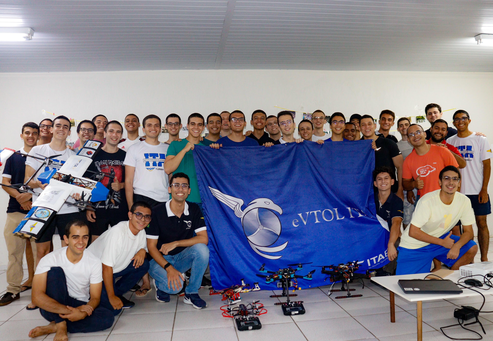
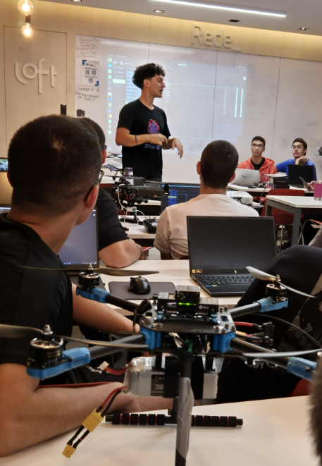
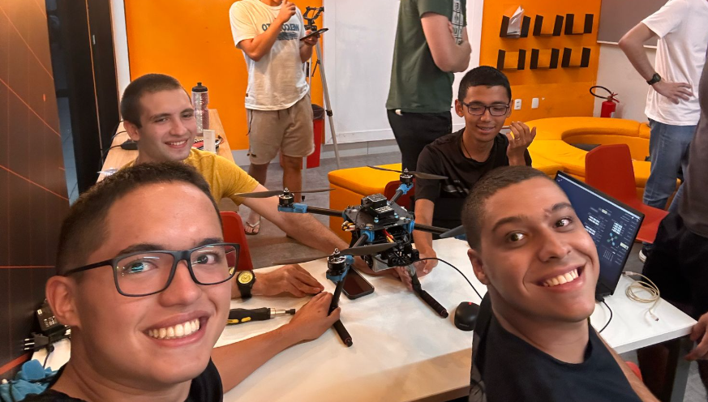
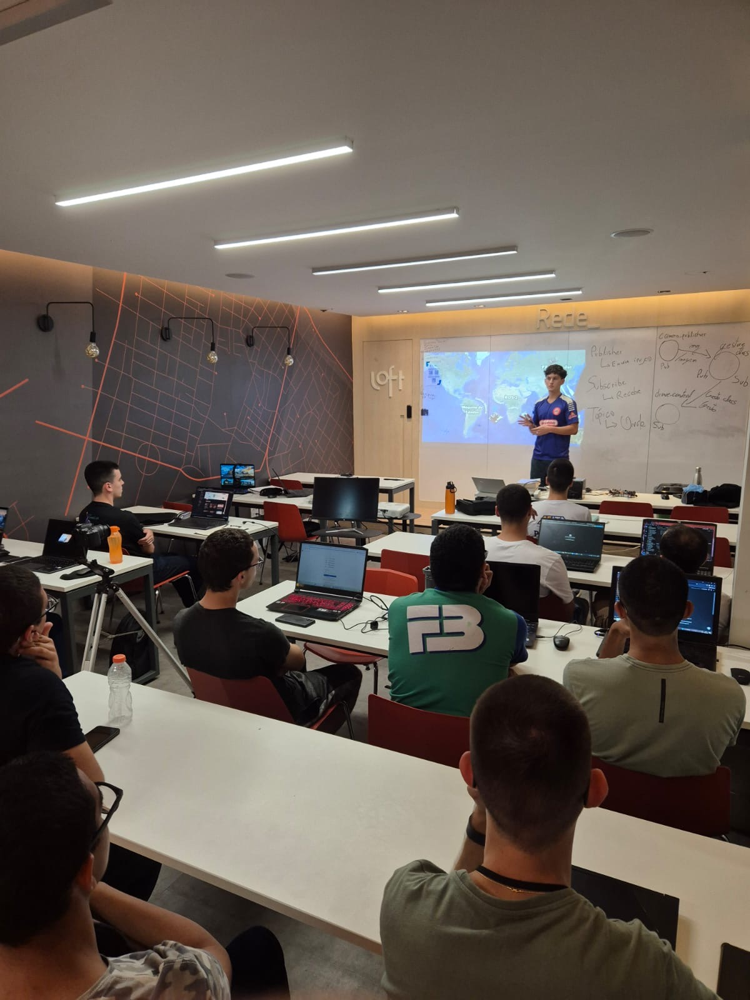
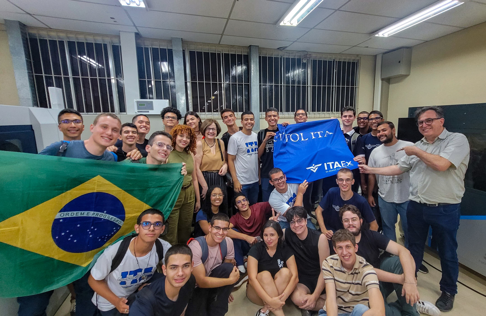
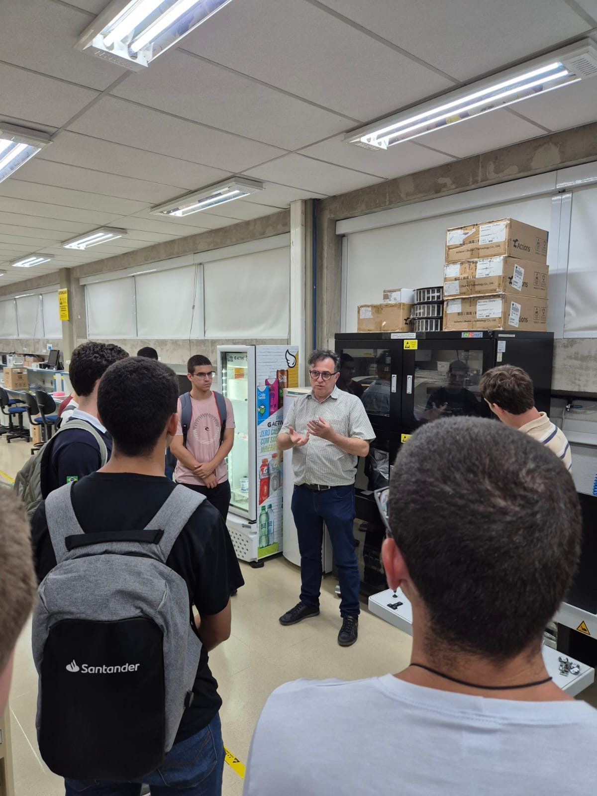
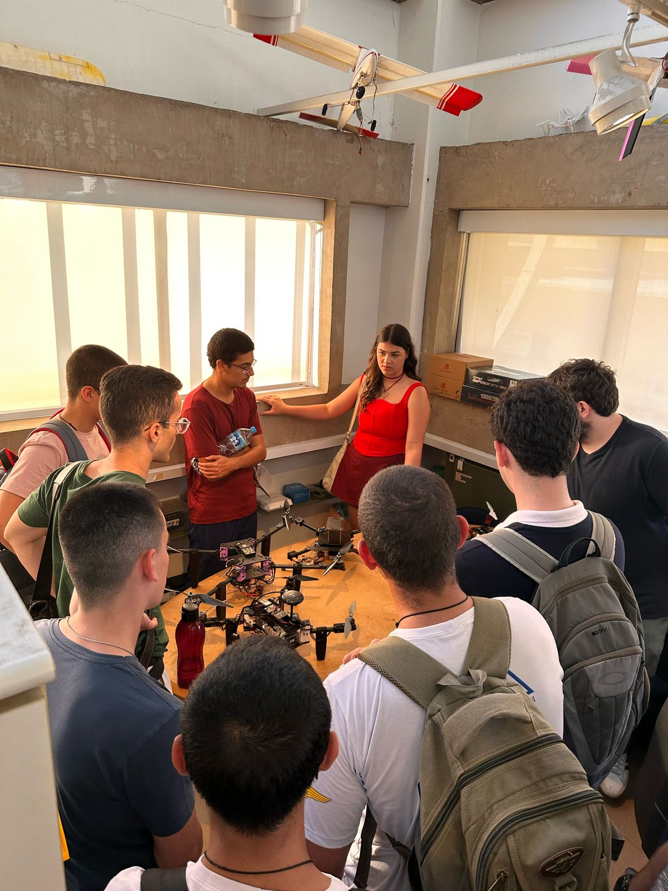
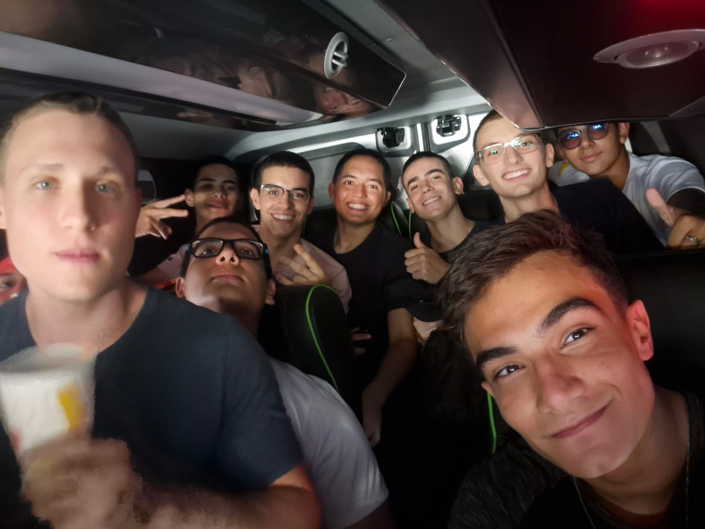
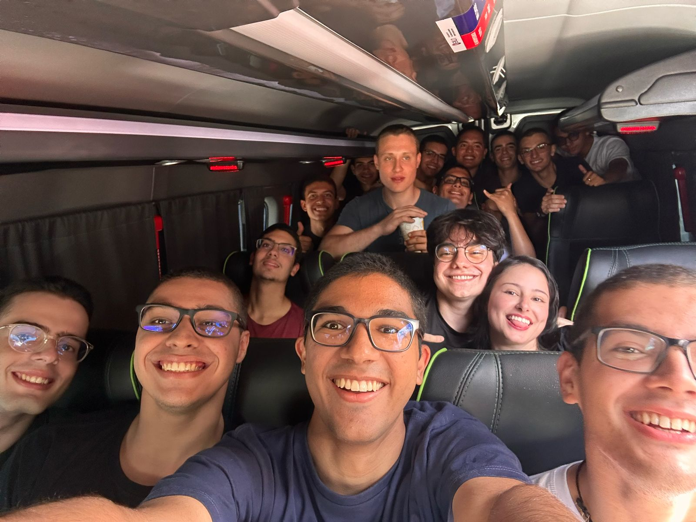
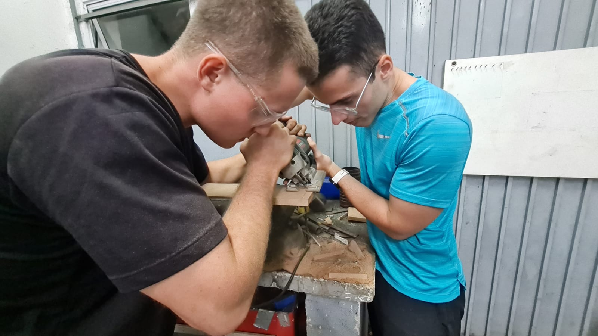

 
<h2 class="titulo">Reunião Geral com novos membros</h2>

Realizamos uma reunião geral com toda a equipe para mostrar mais detalhadamente o que é a iniciativa eVTOL, o que já conquistamos e o que queremos conquistar. Esse encontro foi essencial para garantir que todos estejam cientes dos objetivos e desafios dos projetos e competições.

    

 
<h2 class="titulo">Treinamento de Hardware</h2>

Como bixos, por natureza, não sabem de nada, nós os ajudamos dando um pontapé inicial para que não fiquem totalmente perdidos! O primeiro treinamento foi o de hardware, feito com uma dinâmica que combinava prática e teoria com o objetivo de familiarizar os novos membros com o sistema dos nossos drones.

    
    

 
<h2 class="titulo">Treinamento de Software</h2>

Não só de hardware vive o bixo. Nessa aula, foi ministrado o conhecimento para melhor compreender os bastidores de como pensa o drone. Lá foram ministrados conceitos como:

<ul class="texto">
    <li>Robot Operating System (ROS)</li>
    <li>PX4-autopilot</li>
    <li>Agente DDS</li>
    <li>Machine Learning</li>
    <li>Visão computacional</li>
</ul>

    

    

 
<h2 class="titulo">Alunos do ITA visitam SKYRATS</h2>

Nossa equipe realizou uma visita à Skyrats, equipe de drones da USP. Essa interação fortaleceu nossa rede de colaboração estreitando laços entre os que virão a manter a indústria de drones do Brasil.

    

    
    

    <video controls>
        <source src="./assets/videos/theoffice_visita_skyrats.mp4" type="video/mp4">
    </video>

 
<h2 class="titulo">ZIPA DRONEZADA!!</h2>

    
    

 
<h2 class="titulo">Montagem do Drone</h2>

Nesta etapa, realizamos a montagem de um dos drones, seguindo um planejamento detalhado para garantir a melhor performance e estabilidade.

    
    

 
<h2 class="titulo">Calibração do PID</h2>

Nosso drone não cambaleia! Isso é garantido por nossa equipe! Estabilidade e precisão é o que se obtém após um trabalho bem feito na calibração do PID. Realizamos testes práticos para ajustar os parâmetros e obter a excelência no voo do nosso drone.

    

